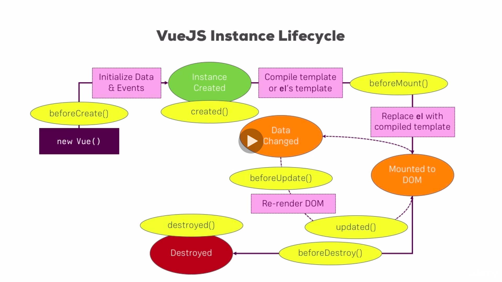

### Using Components - Reusable Component

HTML

```
<div id="app1">
  <h1 ref="heading">
    {{title}}
  </h1>

  <button @click="show" ref="myButton">Show Paragraph</button>
  <p v-if="showParagraph">New Paragraph</p>
</div>

<div id="app2">
  <h1>
  {{ title }}
  </h1>
  <button @click="onChange">
  Change something in Vue 1
  </button>

  <!-- Reusable Component -->
  <hello></hello>
</div>


<div id="app3"></div>
```

CSS

```
p {
  margin-bottom : 20px;
}

#app2 {
  margin: 20px 0
}
```

Javascript

```
var data = {
	title : 'The Vue Instance',
    showParagraph : false,
}

Vue.component('hello',{
	template : `<h1>Hello</h1>`
})

var vm1 = new Vue({
  data : data,
  methods : {
		show(){
			this.showParagraph = true;
      this.updateTitle("The Vue Instance(Updated)");
      this.$refs.myButton.innerText = "Button Changed"
    },
    updateTitle(title){
			this.title = title
		}
	},
  computed : {
			lowercaseTitle(){
				return this.title.toLowerCase();
      }
		},
    watch : {
			title(value){
				alert("Title Changed, new Value :" + value)
			}
		}
})

vm1.$mount('#app1');
vm1.$refs.heading.innerText = "Something else"

setTimeout(function(){
	vm1.title = "Change by Timer"
  vm1.show();
} ,3000)


var vm2 = new Vue({
	el : "#app2",
  data : {
		title : "The Second Instance"
	},
  methods : {
		onChange(){
			vm1.title = "Changed!"
		}
	}
})

var vm3 = new Vue({
 selector : "#hello",
	template: `<h1>Hello</h1>`,
})

vm3.$mount('#app3'); // First Way
document.getElementById("app3").appendChild(vm3.$el) // Second Way
```

---

### The VueJS Instance Lifecycle



---

### The VueJS Instance Lifecycle in Practice

HTML

```
<div id="app">
  <h1>{{ title }}</h1>
  <button @click="title = 'Changed'">Update Title</button>
  <button @click="destroy">Destroy</button>
</div>

```

Javascript

```
new Vue({
	el : "#app",
  data : {
		title : "The VueJS Instance"
	},
  beforeCreate(){
		console.log("beforeCreated()")
	},
  created(){
		console.log("created()")
    // Created VueJs Instance
  },
  beforeMount(){
		console.log("beforeMount()")
    // it hasnt been mounted to the dom
	},
  mounted(){
		console.log("mounted()")
    // it is attached to our real DOM , we can see it on the browser
  },
  beforeUpdate(){
		console.log("beforeUpdate()")
    // When data changes
	},
  updated(){
		console.log("updated()")
    // Updated
  },
  beforeDestroy(){
		console.log("beforeDestroy()")
	},
  destroyed(){
		console.log("destroyed()")
    // its good to do some cleanup work or beforeDestroy hook to be precise. it also stop the vue instance (function not working)
  },
  methods : {
		destroy(){
			this.$destroy()
		}
	}
})
```

---
